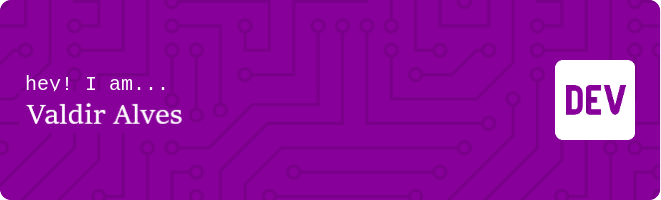

Sou um desenvolvedor full stack ❤️ por enfrentar grandes desafios tecnológicos.    Minha experiência abrange desde o desenvolvimento de backends utilizando NestJS e Express até a criação de interfaces de usuário no frontend com ReactTS e NextJs. Tenho paixão por explorar novas tecnologias e aplicá-las na criação de soluções de alta qualidade. Atualmente, estou focado no desenvolvimento web como um desenvolvedor full stack júnior, <strong>pronto para contribuir e aprender cada vez mais neste emocionante campo da tecnologia.</strong>

 

 &nbsp;
 &nbsp;

## My Skills

#### Main Stack:

&nbsp;
&nbsp;
&nbsp;
&nbsp;
&nbsp;
&nbsp;
&nbsp;

#### Studying in this moment:

&nbsp;
&nbsp;

#### Databases:

&nbsp;
&nbsp;

#### Workstation Tools:

&nbsp;
&nbsp;&nbsp;

## Contacts:

&nbsp;&nbsp;
 

